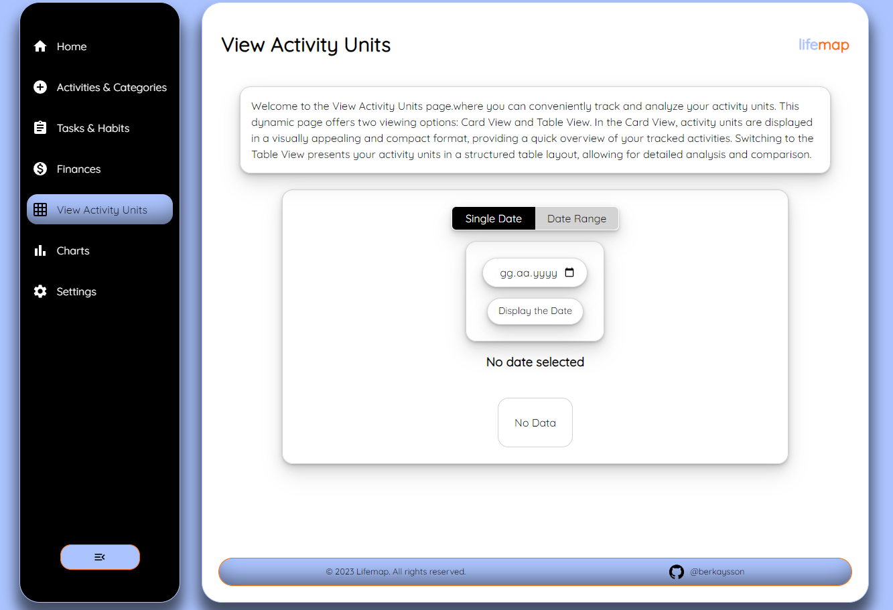
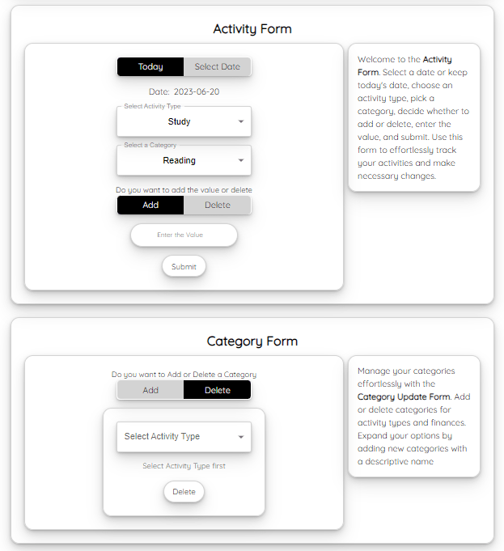
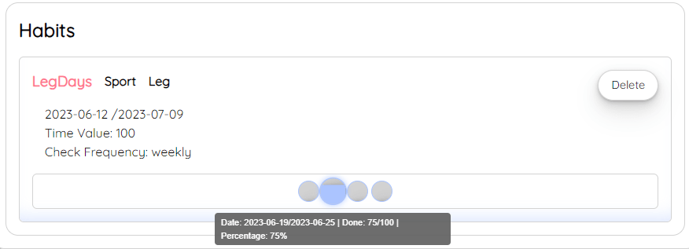
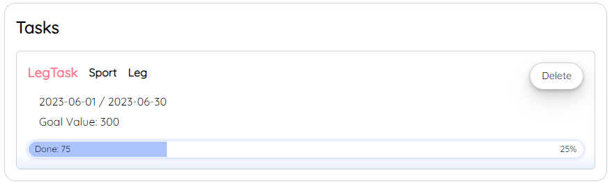

# LifeMap

LifeMap is a personal dashboard that helps you track your habits, goals, expenses, tasks, and activities all in one place. With LifeMap, you can set and monitor progress towards personal goals and habits, track expenses and income, manage tasks, and keep track of various activities like studying, sports, and gaming.

---

## Features

### Activity Units
- **Activity Units** is a powerful tool designed to help users log their daily activities, track their time management, and easily integrate with the Tasks and Habits features. With this application, users can easily create, categorize, and monitor their activity units, allowing them to stay organized and focused on their goals.
- By customizing the categories, users can have a more personalized and relevant tracking experience.

### Habits
- **Habits** feature is a tool that helps you create and maintain habits in your daily, weekly, or monthly routine. With this application, you can easily track your progress and stay committed to your desired habits.
- **Habit frequency** is one of the key features of the ***Habits***. Ability to multiply your habits by defining periods and frequency. For instance, you can set a habit to repeat for 5 weeks on a weekly basis. This means that the program will automatically check and monitor your habit every week for a total of 5 weeks.

### Tasks
- **Tasks** is a feature that allows users to set specific goals for completing activities within a defined date range. It provides a structured approach to managing one-time tasks and ensures that users stay on track by monitoring their progress based on the allocated time.

### Finances

- The finance feature in LifeMap allows users to track their income and expenses, helping them maintain financial control and achieve their goals.

 

- **Tasks** are single-time activities with set start and end dates, where users aim to accomplish specific goals within a given timeframe. **Habits**, on the other hand, are recurring activities that users want to incorporate into their daily, weekly, or monthly routines. By specifying the frequency and period of these habits, users can track their consistency and progress over time, fostering positive behaviors and improved time management. Both features contribute to enhancing productivity and helping users achieve their desired outcomes.

## Technologies Used

-  JavaScript
-  React
-  CSS
-  React Router
- IndexedDB
-  Dexie.js
-  Styled Components
-  Material UI

## Getting Started

1. Clone the repository
2. Install dependencies by running `npm install`
3. Start the development server by running `npm start`

## Contributions

Contributions are welcome! Feel free to fork the repository and submit a pull request.
